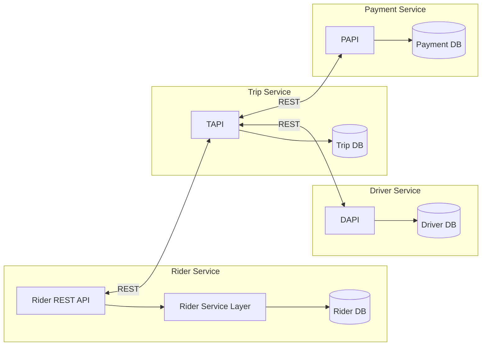
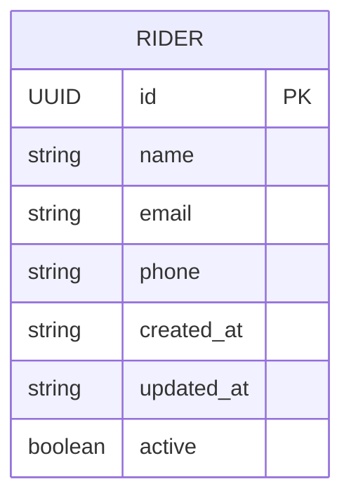
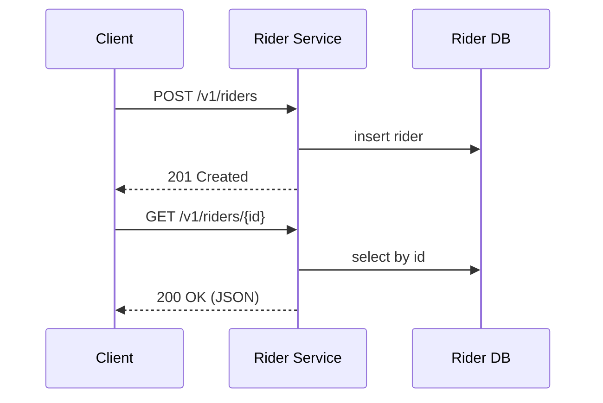

# Rider Service

> Tech Stack : 
Gradle  
Java 25  
Spring Boot 3.5+  
Docker  
Docker Compose  
PostgreSQL  
Minikube  
JSON logs  
ELK 
No UI(Postman Client)

---

## Quickstart (Local with Docker Compose)

```bash
# 1) Build Rider service image
cd rider-service
./gradlew clean bootJar
docker build -t rhf/rider-service:latest .
cd ..

# 2) Bring up DB + Rider + ELK (non-default ports used)
docker compose up -d

# 3) Health check
curl http://localhost:9081/actuator/health

# 4) Try APIs
curl http://localhost:9081/v1/riders
```

Ports chosen:
- Rider service: **9081**
- Rider DB (Postgres inside container 5432) published on host **5544**
- Elasticsearch: **9201**
- Kibana: **5602**
- Logstash (TCP): **5044**

Seed data: `rider-service/src/main/resources/rhfd_riders.csv` is ingested on first boot.

---

## Postman Collection

Import `postman/RiderService.postman_collection.json` and hit:
- `GET /v1/riders`
- `GET /v1/riders/{id}`
- `POST /v1/riders`
- `PUT /v1/riders/{id}`
- `DELETE /v1/riders/{id}`

Base URL env: `http://localhost:9081`

---

## Minimal Architecture (Phase 1)



Database-per-service pattern; no cross-DB joins.

---

## Rider ER (minimal)



---

## Rider Workflow (simple)



---

## JSON Logs + ELK (Filebeat Pipeline)

- Each Spring Boot service writes structured JSON logs to rotating files under `/app/logs` using a Logback RollingFileAppender.
- **Filebeat** runs as a sidecar/companion container, tails these JSON log files, and forwards them to **Logstash** on port `5044`.
- **Logstash** parses and sends logs to **Elasticsearch**, where they are indexed.
- You can explore and visualize logs in **Kibana** at [http://localhost:5602](http://localhost:5602).

**Flow overview:**
Spring Boot → RollingFileAppender (JSON) → Filebeat → Logstash :5044 → Elasticsearch → Kibana


Bring up stack:
```bash
docker compose up -d
# Then open Kibana and add index pattern: logstash-*
```

---

## Minikube (Beginner Steps)

```bash

cd rider-service
#rebuild image 
docker build -t rider-service:latest .

#check image 
docker images | grep rider-service
# Start cluster
minikube start

kubectl get nodes


# Create namespace
kubectl create ns rhf

# Apply rider k8s
kubectl apply -n rhf -f k8s/rider/
# Point Docker CLI to Minikube’s environment
eval $(minikube docker-env)


# See pods and services
kubectl -n rhf get pods
kubectl -n rhf get svc

# Port-forward Rider
kubectl -n rhf port-forward svc/rider-service 9081:9081
curl http://localhost:9081/v1/riders
```

```bash
minikube dashboard
```
This opens a web UI for Pods/Deployments/Services. Alternative TUI: `k9s`. GUI: `Octant`.

---

## Commands Cheat Sheet

```bash
# Build
cd rider-service && ./gradlew clean build

# Run Rider only (local dev profile uses localhost DB port 5544)
SPRING_PROFILES_ACTIVE=local java -jar build/libs/rider-service-*.jar

# Docker Compose logs
docker compose logs -f rider-service

# Kubernetes basics
kubectl -n rhf get pods
kubectl -n rhf logs deploy/rider-service
```

---

## Repo Layout 

```
.

```

---

Run:
```bash
docker compose up -d
# Then in Kibana, add index pattern: logstash-*
```


Rider Service → /app/logs/rider-service.json → Host path /tmp/rider-logs
↑
Shared via volume
↓
Filebeat DaemonSet (reads same /tmp/rider-logs)
↓
Logstash → Elasticsearch → Kibana
